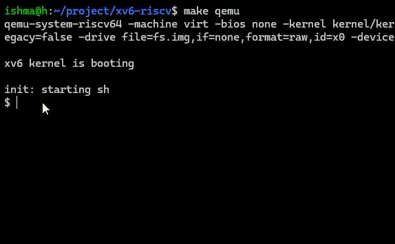

# Lottery Scheduler for xv6

## Author

Ahmed Ishmam Arefin - 2322035642

## Overview

This project replaces the default Round Robin scheduler in xv6
with a lottery scheduling algorithm as taught in the CSE323 Operating Systems Design course.

Each process is assigned a number of tickets. At every scheduling
round, the scheduler randomly selects a winning ticket, and the
corresponding process receives the CPU.

## Features

- Lottery-based CPU scheduling
- Per-process ticket allocation
- `settickets()` system call
- `getpinfo()` system call
- Per-process CPU runtime tracking
- Performance test comparing 10-ticket and 90-ticket processes

## Demonstration

Two CPU-bound processes compete for the CPU:

- Process 1: 10 tickets
- Process 2: 90 tickets

The measured CPU allocation approaches the expected 10% / 90%
distribution over repeated runs.

## Environment

- xv6-riscv
- RISC-V
- QEMU
- Ubuntu/WSL

## Usage
Compile xv6 to boot it up in Ubuntu/wsl environment.
`make clean`
`make qemu`

## Visual Representation

